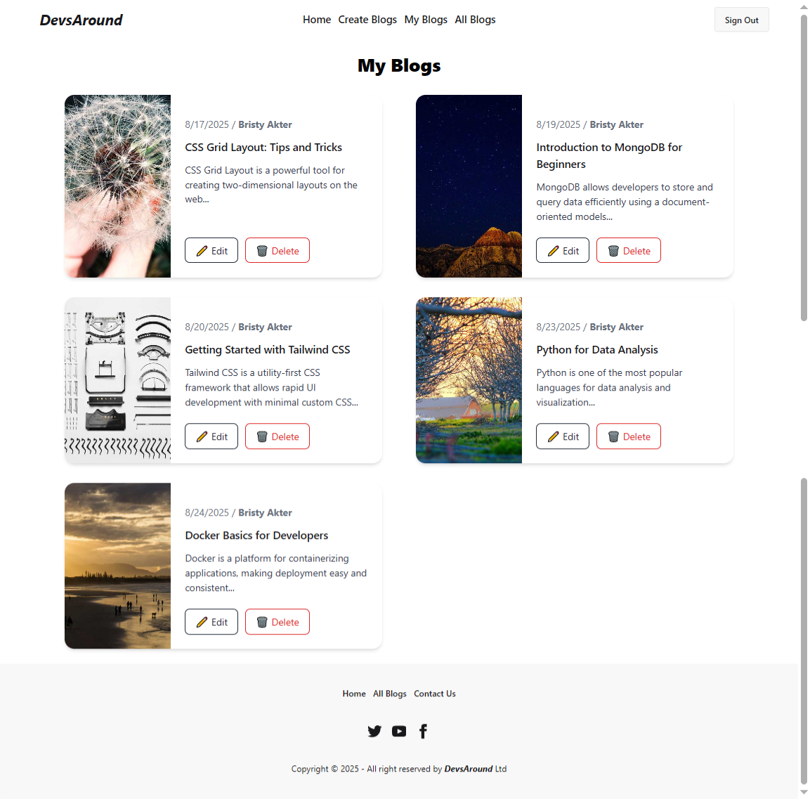
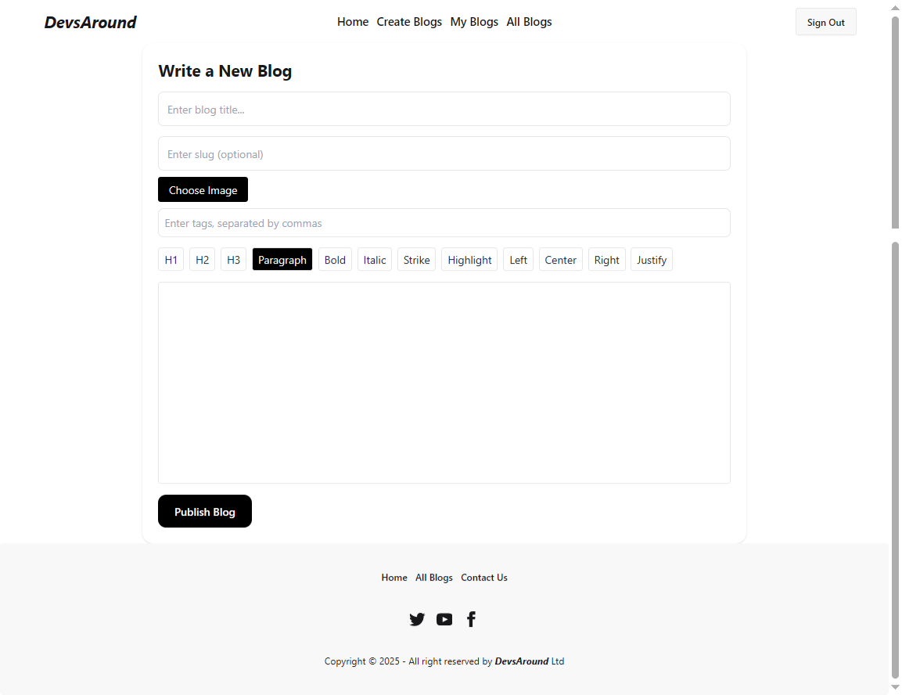
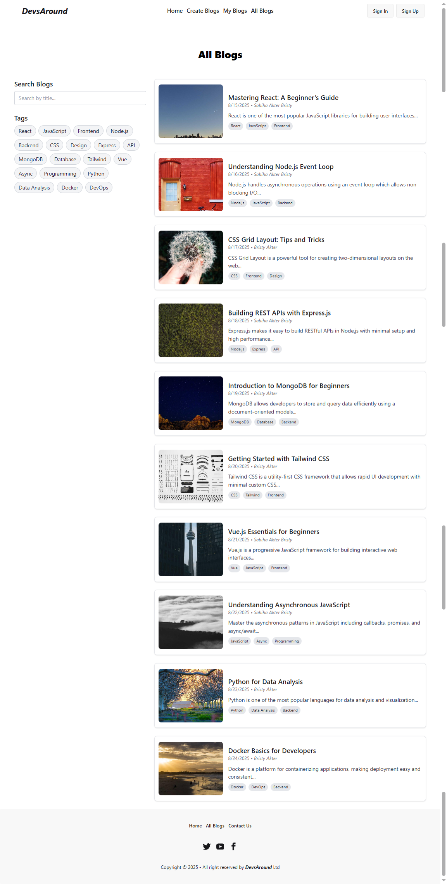
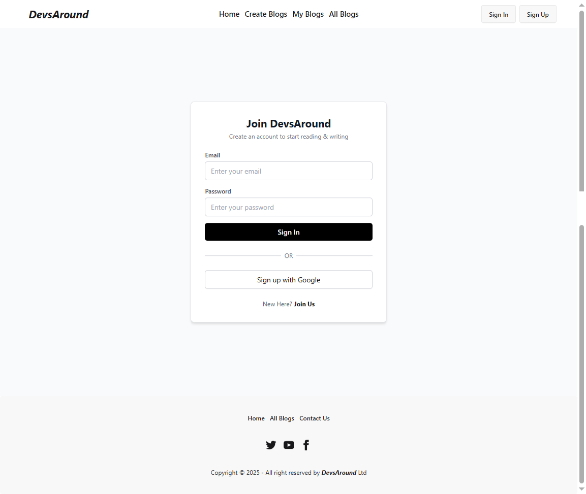

# DevsAround Blog Website

## Project Introduction
This is a **dynamic blog platform** built with **React.js**, **Node.js**, **Express.js**, and **MongoDB**. Users can read blogs, create posts, search by tags, and manage their own blogs.  

**Live Site:** [DevsAround Blog Website](https://react-auth-private-route-c0a3a.web.app/)


**Screenshots:**

### 🏠 Home Page


### ✍️ My Blogs Page


### ➕ Create Blogs Page


### 📚 All Blogs Page


### 🔑 Sign In Page


---

## Tech Choices
- **Frontend:** React.js  
- **Backend:** Node.js + Express.js (REST APIs)  
- **Database:** MongoDB (Atlas or local)  
- **Authentication:** Firebase  
- **Editor:** React + TipTap
- **Styling:** Tailwind CSS + DaisyUI + Framer Motion  

**Why these choices:**  
- React.js for a fast, component-based frontend with dynamic UI updates.  
- MongoDB for a flexible document-based schema that easily handles blog data.  
- Firebase Authentication for secure and easy-to-integrate user authentication without managing JWTs.  
- Tailwind CSS + DaisyUI for rapid, responsive, and attractive UI development.  

---

##  Installation

 Clone the repository  
```sh
git clone https: https://github.com/Bristyakter25/devsAround-blogs-system
cd devsAround-blogs-system
```

 Install dependencies  
```sh
npm install
```
 Run the development server  
```sh
npm run dev
```

---
### Environment Variables

Frontend (frontend/.env.example):

VITE_API_KEY=
VITE_AUTH_DOMAIN=
VITE_PROJECT_ID=
VITE_STORAGE_BUCKET=
VITE_MESSAGING_SENDER_ID=
VITE_APP_ID=

Backend (backend/.env.example):

DB_USER=
DB_PASS=

### **Frontend (Client-Side) Dependencies**
```json
"dependencies": {
    "@tiptap/extension-highlight": "^3.3.0",
    "@tiptap/extension-image": "^3.3.0",
    "@tiptap/extension-text-align": "^3.3.0",
    "@tiptap/react": "^3.3.0",
    "@tiptap/starter-kit": "^3.3.0",
    "firebase": "^12.1.0",
    "framer-motion": "^12.23.12",
    "localforage": "^1.10.0",
    "match-sorter": "^8.1.0",
    "react": "^19.1.1",
    "react-dom": "^19.1.1",
    "react-icons": "^5.5.0",
    "react-router-dom": "^7.8.2",
    "sort-by": "^1.2.0",
    "sweetalert2": "^11.22.5",
    "swiper": "^11.2.10"
  }
```
### **Backend (Server-Side) Dependencies**  

```json
"dependencies": {
    "bcrypt": "^6.0.0",
    "cors": "^2.8.5",
    "dotenv": "^17.2.1",
    "express": "^5.1.0",
    "mongodb": "^6.19.0"
  }
```

### **Development Dependencies**  

```json
"devDependencies": {
  "nodemon": "^3.x.x",
  "eslint": "^8.x.x",
  "prettier": "^3.x.x"
}
```


### Run Development

```bash
 npm run dev
```


## Useful URLs

**Live Site:** [DevsAround Blog Website]()

**API Docs:**  [Server](https://blog-site-server-gamma.vercel.app/)


---


**Service Ports:**

* Web: 5173
* API: 5000

---

## Known Issues & Tradeoffs

* Some features are client-side only; SSR not implemented everywhere.
* No rate limiting on APIs (for simplicity).
* File uploads limited to certain size and types.

````


